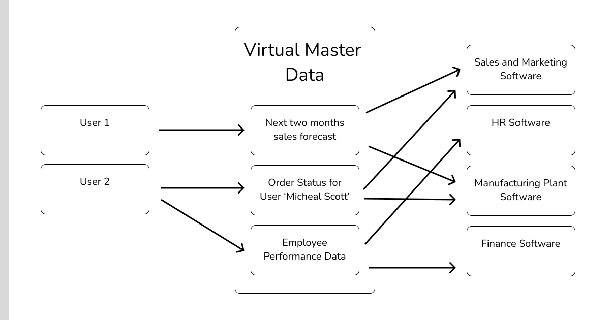

### Business Functions
> A Business Function is an isolated operation of a business area. For example, *Marketing a product* is a business function of *Marketing and Sales* area of the business

### Business Process
> Business Process is a collection of *Business Functions* integrated with each other to perform a business workflow. For example a business process, "Returning a product" involves multiple business functions like "updating the accounts" and "updating the inventory", etc

### The Difference
To better understand the difference between a Business Function and Business Process let's consider an example. 

You own a car-dealership. A customer comes in and he wants to buy a car. If we look at it from the customer's point of view, he would need the following operations performed by the dealership for him.

1. Provide the financing information.
2. Place an order for the car to be built.
3. Pack all the informationa and send it to the customer.
4. Deliver the car.
5. Recommendations for the future services and promotions.

If we would be living in an 1820's (Not sure if there were any cars back then) without computers the workflow would go something like this.

1. A sales representative would had to contact Accounts and Finance department to run the credit check against the customer and provide the financing options.
2. Once the financing is approved, the sales representative would had to send the paper work for the purchase to the manufacturing plant via mail.
3. Once the order is placed the sales representative would had to call the manufating plant every now and then to know the status on the built and notify the client.
4. Once the car is build, the manufacturing plant had to call HR or Management to arrange for a person to pick up the car and deliver it to the customer.
5. Once the car is delivered, the dealership needs to send the reminder to the client for frequent auto services, like an oil change for which a customer service representative have to contact multiple departments to gather the information about the client's needs and recommend him accordingly.

Now let's get back to 2023:

If your dealership is AAA, you would have invested in an exceptional software system which with one-click performs all the above actions. Just by entering the client's information, the software will spit out all the financing options, the estimated time for the car to be built and delivered, the next oil change and what would it cost and probably assign a worker for delivering the car when the time arrives. If the customer is satisfied, the software might also allow you to place the order, on the spot.

**In this example, all the operations listed above are the business functions of the business process "Buying a car"**

If you notice the business functions above, they are completely isolated, they belong to different domains and they don't have anything to do outside of that domain (Finance and Account, Manufacturing and Sales, etc.). When they are integrated with each other with the help of a software, collectively they create a business process of buying a car. 

A Business Function is focused toward the business operations and a Business Process is more focused toward a client's point of view. 

### Which one is better?
Having isolated business functions have their drawbacks for sure. A business might have isolated software systems for their isolated departments, like Finance Department has it's own software and Sales and Marketing Department has it's own and they don't communicate with each other. There are two game-changing drawbacks the can blow a big hit to the business:

1. A lot of same kind of information exists among these isolated systems, like client's information, delivery dates and prices etc. If these systems are not synced then you will have conflicting information which can result in confusion and ambiguity. This can lead to loss in sales.
2. You waste a lot of time. You have to keep these systems in-sync and a lot of time can be wasted in data-entry process. You also waste time because you have to gather the information from the different departments and connect it as well, which can cause a lot of delays and waste of valuable resources.

Investing in a system that let's you integrate all you business departments and perform client oriented business processes saves time, money and effort which are very valuable resources for any business. Just by connecting the departments you have a bird's eye view on every process without spending any extra effort or time. Client called about the status on their delivery? With one click you have information from the manufacturing plant and HR at your disposal and a CRM to send this information to the client. Heck, we can provide a portal to the client to check the status for themselve.

### How to build the Business Processes using Softwares?
Building a systems that facilitates Business Processes is all about centralization of data. The better an enterprise can centralize it's data, the better they can make the Business Processes around it. Data is the root of any business. Your business is as flexible as the flexibility of the means to access the data. When this huge amount of data from different departments is systematically centralized we call it the Master Data

##### Use an ERP System
Most easiest but an expensive way to centralize this data is to invest in an ERP Software. An ERP Software is a one-stop-shop for all the enterprise processes needs. A decent ERP System will let you combine the data from all the departments for the business process. You need a report for financial planning? It will request Master Data for the data from Sales, Marketing and Finance departments to generate those reports.

##### Use APIs to built Virtual Master Data
If you have softwares that are only limited to their departments, one can utilize the APIs these softwares provide and use that to generate Virtual Master Data. Virtual Master Data is basically an interface layer which takes requests for data and generate the data by performing multiple business functions on different departmental software data-sources. It is basically a simulated Master Data which simulates that the data is coming from one source, but in the backend, it's pulling the data from different sources.

If you are using the third party softwares then this really depends on the software vendors whether they want to expose their API or not. If you can't find their APIs you can always contact them and they might arrange it for you.

If you have these department softwares built in-house, you can always create APIs around these softwares. 

### Access Data from Master Data
Once you have centralized your data, you can use ETLs to request this data from the Master Data. Or a better approach would be to build APIs around the master data for your needs. Cloud Platforms like GCP, Azure and AWS provides ways to create such APIs around Master Data. For Example, AWS has Lambda Functions using which you can perform different functions on any AWS Resource. One can utilize the Lamda Functions to request required data from the Master Data.

### Conclusion
A Business Process is a collection of integrated Business Functions. A business is most optimal when the business functions are integrated and they can talk to each other. To implement the business process, a business need to centralize its data. For this purpose, one can either invest in an ERP Software System or utilize the APIs for the existing isolated software systems.

### Connect
Twitter👉 https://twitter.com/tweetharisahmad \
LinkedIn👉 https://www.linkedin.com/in/harisahmadlink/ \
Instagram👉 https://www.instagram.com/hariscodes/